# tam-plantuml-cheat-sheet

A cheat sheet to write TAM notation in plantuml.
The cheat sheet is based on the provided TAM spec in this repo.

## Links

- [FMC and TAM](http://www.fmc-modeling.org/fmc-and-tam)
- [SAP Standard Document: Standardized Technical Architecture Modeling](http://www.fmc-modeling.org/download/fmc-and-tam/SAP-TAM_Standard.pdf)
- [SAP Community Part 1](https://blogs.sap.com/?p=45461)
- [SAP Community Part 2](https://blogs.sap.com/?p=45792)
- [SAP Community Part 3](https://blogs.sap.com/?p=97225)
- [SAP Community Part 4](https://blogs.sap.com/?p=120412)

## Structural Descriptions

### Component / Block Diagram

#### Agents

```
@startuml
agent Agent
@enduml
```

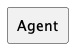

#### Channels

```
@startuml
left to right direction
agent a
agent b
agent c
agent d
agent e
agent f
a -0- b
c -0- d : > R
e -0-> f
@enduml
```

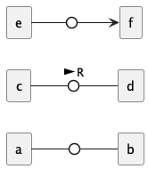

PlantUML does not support an arrow-to-circle notation as wanted by the TAM specification.
You can not write the following `e ->0-> f`.
If you want you could use the workaround with interfaces.

#### Storages

```
@startuml
storage Storage
@enduml
```

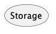

#### Accesses (Read, Write, Modify)

```
@startuml
left to right direction
agent a
agent b
agent c
agent d
agent e
agent f
a -->> b
c <<-- d
e -->> f
e <<-- f
@enduml
```

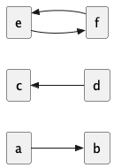

#### COmponents, Classes, Subsystems

```
@startuml
component Component
[ShortHandComponent]
@enduml
```

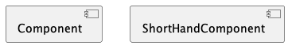

#### Interfaces

```
@startuml
left to right direction
agent a
interface b
agent c
interface C1
a --( b
c --() C1
@enduml
```

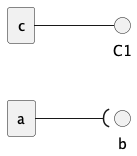

PlantUML does not support receiver interfaces.
We always need to add a "dot" behind the interface (as shown in a to b).

#### Connectors

```
@startuml
left to right direction
agent a
agent b
a -0)- b
@enduml
```

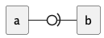

#### Ports

```
@startuml
left to right direction
interface m
component x {
    port " " as y
}
m -- y
@enduml
```

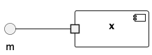

#### Multiple Agents / Storages

```
@startuml
collections agents
collections nested [
    {{
        storage "Storage 1" as store1
        storage "Storage n" as storen
        store1 .. storen
    }}
]
@enduml
```

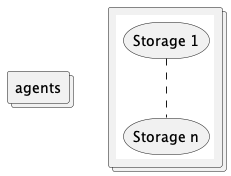

PlantUML only supports collections as multiple instances.
These collections look the same as an agent and can be used as multiple agents.
For storage, we need to use something like nested components in collections and add a dotted line in between.
Because PlantUML does not support three dots only.
An even better solution would be to give the naming some value.
Like `Storages`, `Servers`, `VMs` only for multiple instances of this element.

#### Protocol Boundaries

```
@startuml
agent a
rectangle "Protocol Boundary" #line.dashed {
    agent b
}
a -- b
@enduml
```

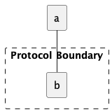

Protocol Boundaries or one single line are not possible with PlantUML.
We can reuse a rectangle or add semantic information to a port.

#### Dependencies

```
@startuml
left to right direction
agent a
agent b

a ..> b : << create >>

@enduml
```

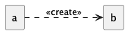

#### Bigger Examples

```
@startuml
collections Users as users
collections "Web Browsers" as browsers

rectangle "HTTP" #line.dashed {
    agent "Web Server" as server
    agent "Directory Agent" as dir
    storage "Persistent Data" as store
    storage "Static HTML Pages" as static
}

users -0- browsers
browsers -0- server : R >
server -0- dir : R >
dir -->> store
dir <<-- store
dir -l->> static
static -u->> server
@enduml
```

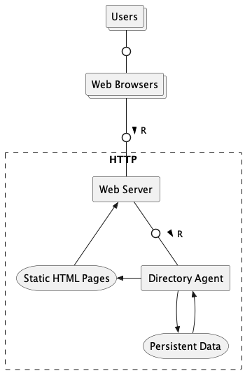

### Class Diagram

### Package Diagram

## Behavioral Descriptions

### Use Case Diagram

### Activity Diagram

### Sequence Diagram

### State Machine Diagram

more comming soon